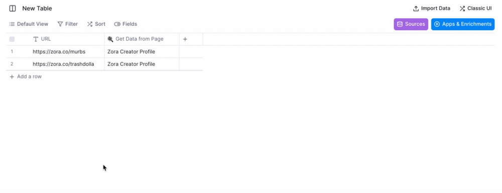

# Map and pull your own page data into Clay

Rather than repeatedly copy-pasting data from pages of the same structure into your table, map one page and use the Clay **"Get Data from Page Action"** to pull the data directly into Clay for all pages of the same structure.

A couple of examples we've seen crop up include Yelp company pages, TikTok profiles, company profile pages on any online directory.

For example:

**1.Head to your website of choice.** To pull in key data for all brand pages using their URL head over to [zora.co](http://zora.co)

**2. Enter Select Data mode and Match your Recipe.** You can think of matching a recipe as creating a map for any similarly structured URL, in this case for any pages that start with [zora.co](http://zora.co/)/:creatorname/articleid. → Follow the instructions in the extension to match your recipe for other URLs.

.gif>)

**3. Pick your attributes.** Click the Select Data from Page button > Select a single attribute option and get mapping!

.gif>)

**4. Pull attributes into Clay.** Pop your link in to a Clay table, add the Get Data from Page — Beta (New Service) action, and let it run to pull your data in! Extract into columns so you can see each attribute easily.

