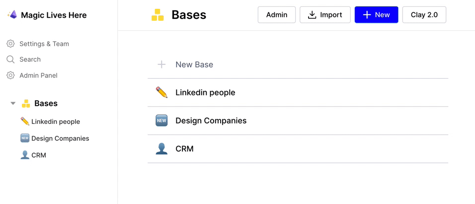

# I'm on Clay 1.0, how can I access 2.0?

Firstly, thanks for being an early user of Clay! We're excited to have you on this next phase of Clay's journey.&#x20;

Navigating between 1.0 and 2.0 is as simple as hitting a button (shown below), but please do note that we will be sunsetting 1.0 at the end of March 2022. For assistance or any questions, you can reach out on friends@clay.run or find the team in our [Slack community](https://www.clay.com/slack).

### Accessing 2.0 from 1.0

### Returning to 1.0 from 2.0

<figure><figcaption></figcaption></figure>
