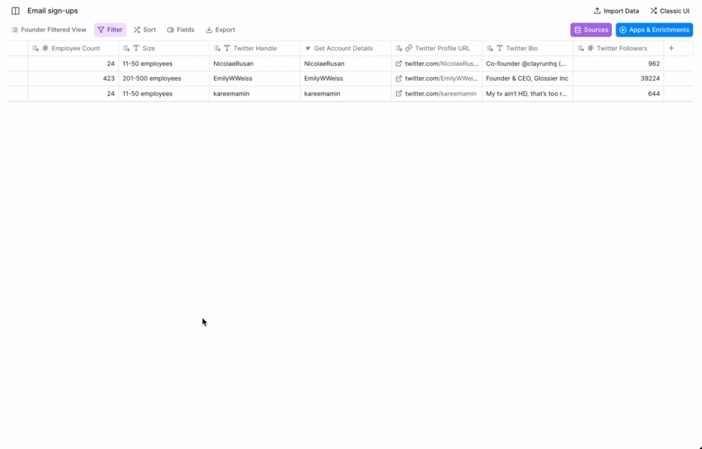
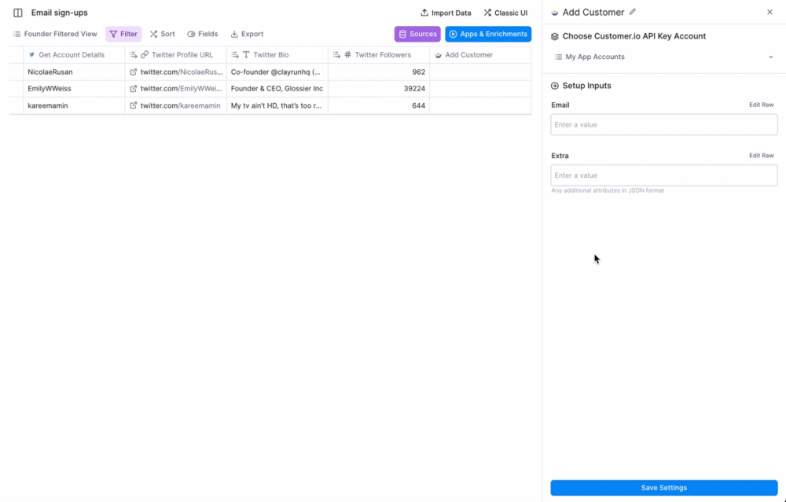
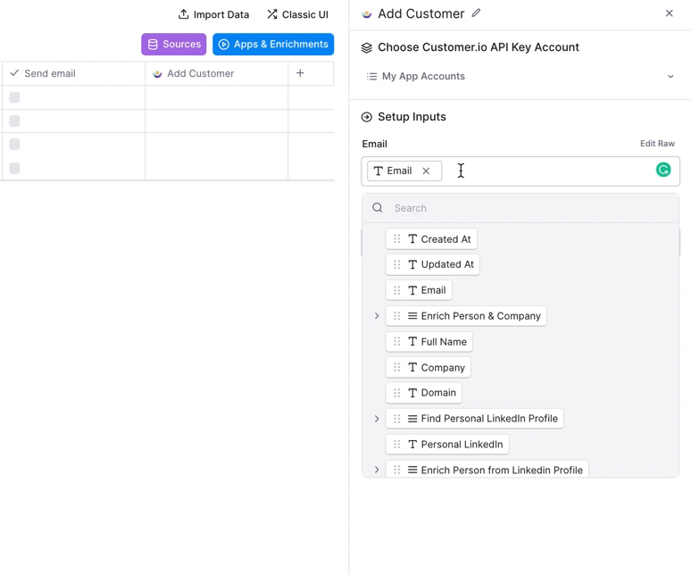

# Customer.io

### Overview

With Customer.io you can automate:

* Personalized thank you emails for new users that signup for your product/waitlist
* Outbound emails to prospective customers
* Trigger drip campaigns to newsletter subscribers

... and much more.

### Step 1 - Setting up your action

Go ahead and find the Customer.io action within Clay's Apps and Enrichments. You'll send use the "Add customer" action to either add a new customer, or update their existing attributes.

### Step 2 - Configure the email column

Every Customer.io action requires an email input as the ID for your new user. Simply drag in their email into the corresponding input field.

### Step 3 - Add additional attributes

The most effective way to trigger email campaigns within Customer.io is to set up **Segments** based on user attributes.

In this example, on Customer.io we have a Waitlist campaign trigged when their attribute called **status** is equal to **waitlist**.

 (1).png>)

Within our Clay table, we add in new attributes in the **Extra** column in JSON format:

Example here:    {"**attribute1**":"**value**","**attribute2**","**value**"}

Each attribute is surrounded by quotations, then separated with commas.

In this example, we're sending the attribute of **status** equalling **complete** which will trigger the Waitlist campaign in Customer.io.

.gif>)

You can also add custom attributes based on the data enriched on your table. In the example below, we added an attribute for "fullname" that took the corresponding record for each row.

.png>)

Custom attributes are treated like any other JSON data and get quotations around the string of text.

### Step 4 - Running email campaigns

Anytime you add new records into the table, the Customer.io campaign will automatically run with the enriched data. You can get started creating thank you emails, transactional messages, and automated campaigns.

### Bonus: Delayed runs

Want leads to flow into your table but still want to manually run campaigns? You can simply create a conditional run that only runs when a checkbox is clicked.

.gif>)

Within the Email input, go to **Edit Raw** and enter an **if()** formula that says if that column is true (checked = true), then use the email. Otherwise, it will not run until the checkbox is checked.

<figure><figcaption></figcaption></figure>
