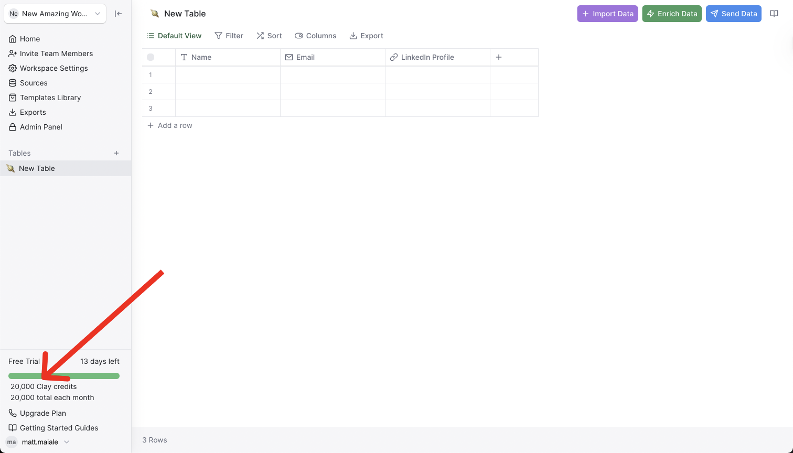
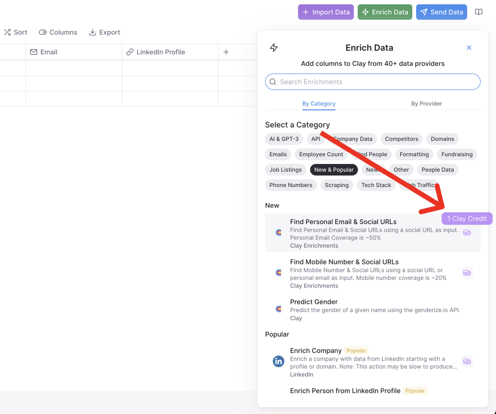
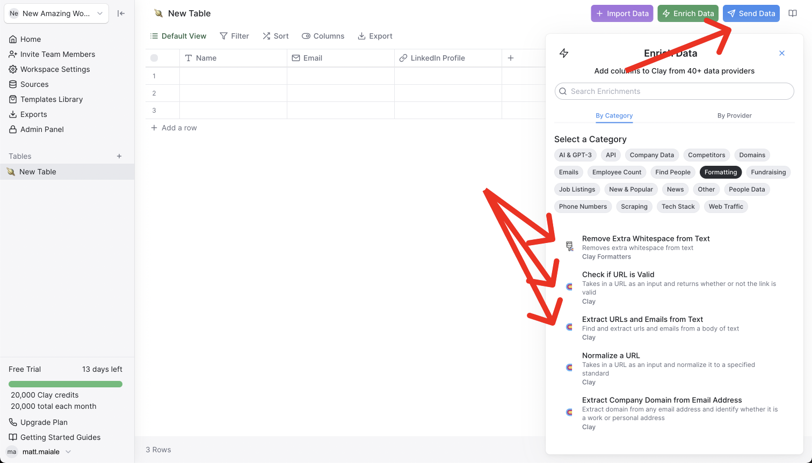

# Clay Credit Usage Tracking



Clay’s new plans introduces three levels of Clay enrichment credits: 20k, 50k, and 100k. More information can be found on [clay.com/pricing](http://clay.com/pricing).

We’ve bundled together all of our enrichments into a simple enrichment system to make it easy for users to access 50+ enrichment services without a single API key.

Here’s a quick rundown of how these credits work:

1. Clay users are given 20k, 50k, or 100k Clay enrichment credits depending on their chosen plan.

<figure><figcaption></figcaption></figure>

2\.  The enrichments that cost credits have an icon next to them in the Enrich data panel. For example, if you have 3 enrichment columns (e.g. Enrich Person, Enrich Company, and Find New events) in a table, each row will use 3 credits. Enrichments usually use 1 credit, but some integrations like “Find Work Email” and “Find & Enrich Person from Google Search” each use 2 credits.

<figure><figcaption></figcaption></figure>

3\.  There are many actions that do not cost any credits including Clay’s formatters and any actions in “Send Data” like HubSpot, Salesforce and Outreach.

<figure><figcaption></figcaption></figure>

4\.   If you provide your own API key, even if it’s for an enrichment tool that normally costs credits, you will not be charged any credits.

5\.   When you run out of credits, you will need to wait until the beginning of your next billing cycle, or can upgrade anytime to a higher plan.

There are a few Premium enrichment tools that are not included in Clay’s enrichment credits. These are People Data Labs, Clearbit, and Owler. You can reach out at friends@clay.run to get access to discounted Premium Enrichment bundles. That said, we strive bring together many different lower-cost enrichment tools so that our users can perform an end-to-end prospecting workflow without needing premium credits.

## Here’s some popular questions on the new credit limitations:

**What happens if I bring my own API key?**

* You will not be charged any credits if you bring your own API key for either Clay enrichments or Premium enrichments.

**What happens if there’s an error or no data found? Am I still charged a credit?**

* If there's an error, then you will not be charged any credits. However, there are a few exceptions that "No Data Found" will charge credits. For instance, if we call Google's API and search a website for keywords, if the result is 0, this still counts as an enrichment credit. This is because 0 is the returned result, not that the API couldn’t find anymore. Similarly for job role count, tech stack, and a few other integrations, if the returned result is 0 then it still counts as a run. All other enrichments such as Find Work Email, Enrich Linkedin, etc. will only be charged as a credit if data is returned.

**Do my Clay enrichment credits rollover each month?**

* Currently credits do not rollover each month for Clay's enrichment credits. However, premium credits will rollover each month.

**What’s included under Clay enrichment credits? What’s under Premium enrichments? And what’s free?**

* Anything within the “Enrich data” tab with a purple credits symbol will let you know how many credits it uses. There are many enrichments that do not use any credits currently including Clay's Formatters.

**Do I get charged if I re-run cells or columns?**

* Yes. You will use a credit for every time that you run a cell within an enrichment column.

**Does performing bulk-runs use less credits than individually running cells?**

* No. We recommend our users be careful with bulk runs because this can be an easy way to run through credits if you’re not cautious about how many rows are in the table. E.g. 1,000 rows will use 1,000 credits.

**Do destinations (tools that I use to send data out of Clay) count as Clay enrichment credits?**

* No. You can run destinations (Send data) as much as you want and this will not count towards your Clay enrichment credit total.
