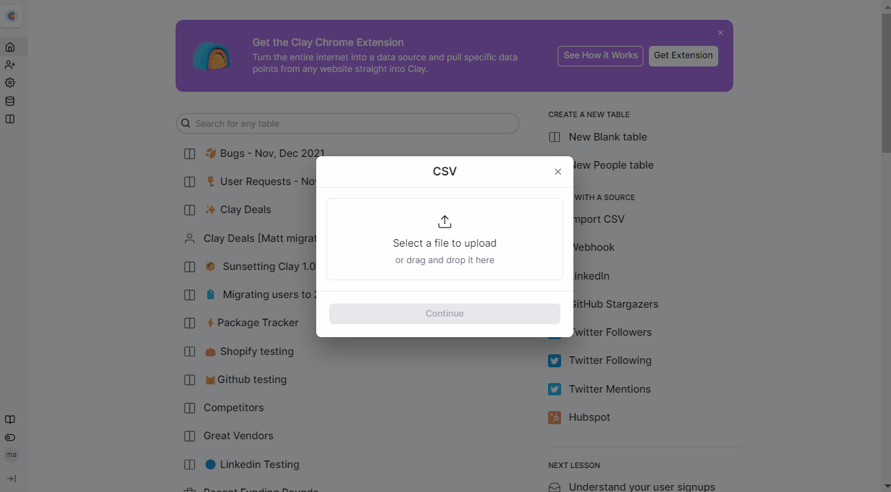

# Import CSV



### Step 1 - Creating a source&#x20;

Create a source using <mark style="color:red;">`Import CSV`</mark>.&#x20;

<figure><figcaption></figcaption></figure>

### Step 2 - Importing CSV

Upload your <mark style="color:red;">`CSV`</mark> file and click <mark style="color:red;">`Continue`</mark>. Select if you want to add the data to your existing table or new table. Click <mark style="color:red;">`Go to created`</mark> table to open.

