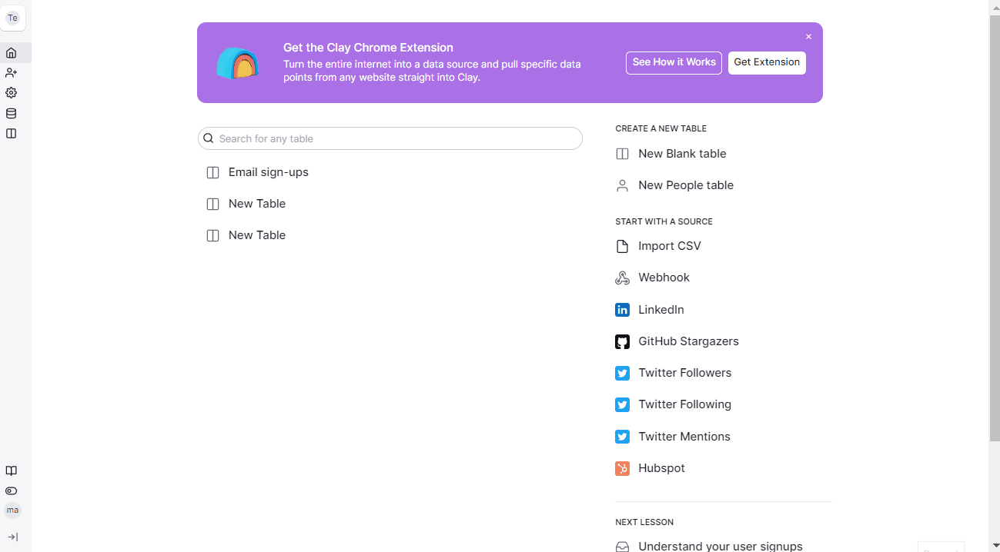
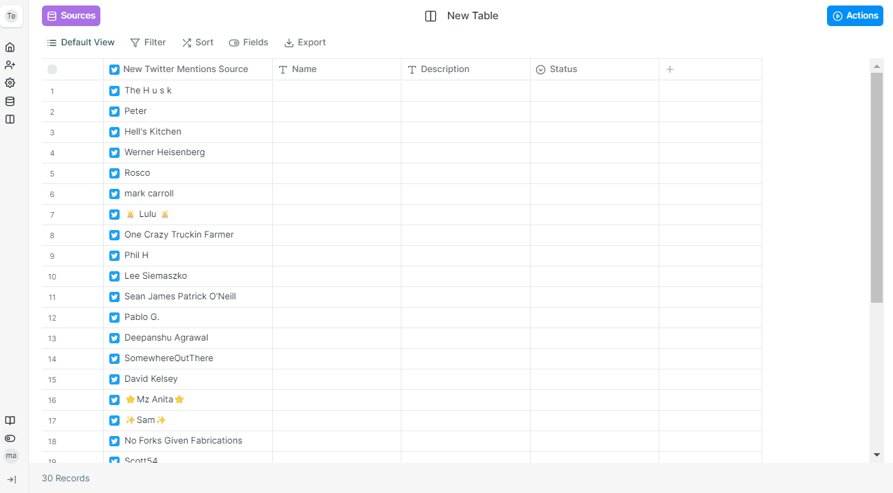

# Twitter Mentions



### Step 1 - Creating a source and adding the Tweet URL

Create a <mark style="color:red;">`Twitter Mentions`</mark> source and authenticate your account then click <mark style="color:red;">`Continue`</mark>. Input the <mark style="color:red;">`Tweet URL`</mark> and select if you want to add the data to your existing table or new table.&#x20;

<figure><figcaption></figcaption></figure>

### Step 2 - Extract data

Click the expand button to extract additional information.

<figure><figcaption></figcaption></figure>
