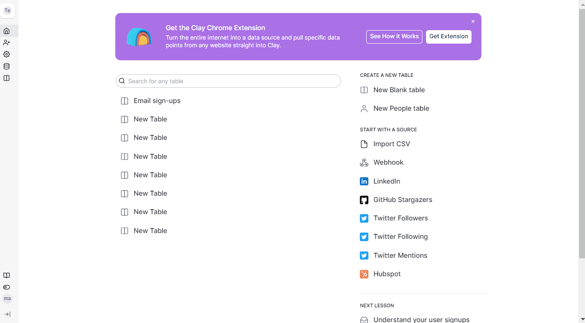
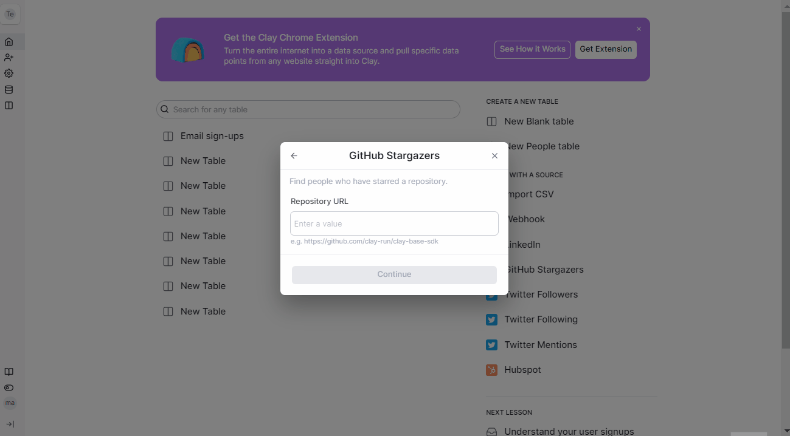

# GitHub Stargazers



### Step 1 - Create a source

Create a <mark style="color:red;">`Github Stargazers`</mark> source and authenticate your account.&#x20;

### Step 2 - Adding repository URL

Add your <mark style="color:red;">`Repository URL`</mark> and click <mark style="color:red;">`Continue`</mark>. Select if you want to add the data to your existing table or new table.&#x20;

<figure><figcaption></figcaption></figure>
