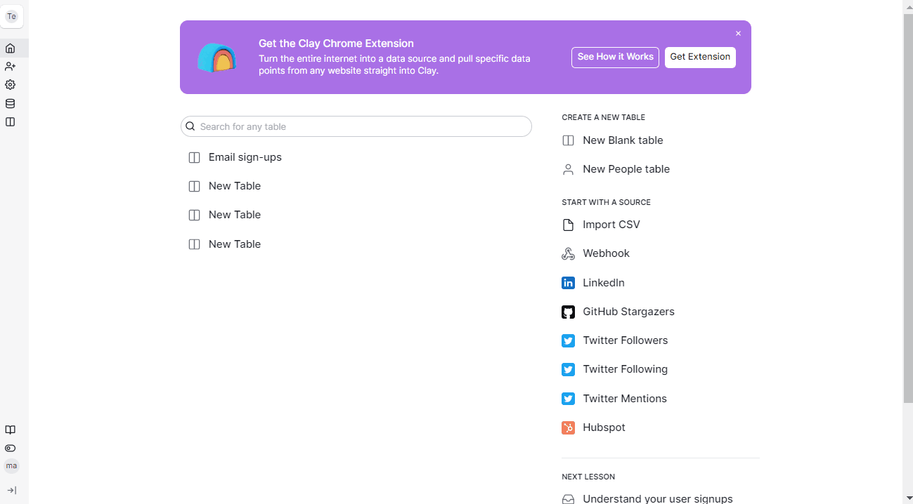
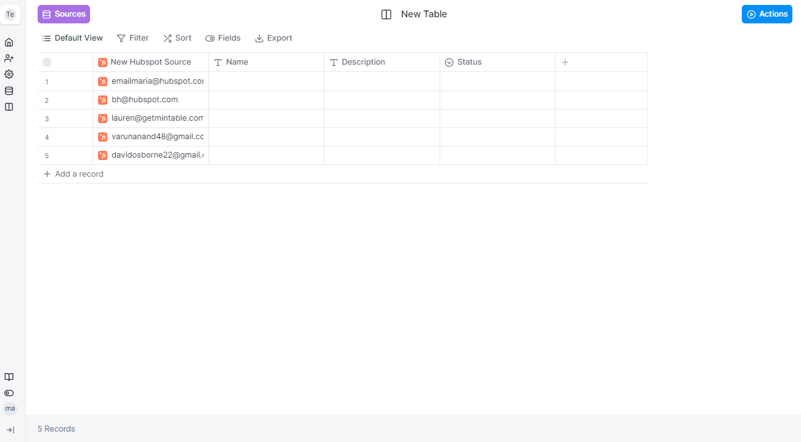

# Hubspot Contacts



### Step 1 - Create a source

Create a <mark style="color:red;">`HubSpot`</mark> source and authenticate your account. Set your data limit and click Continue. Select if you want to add the data to your existing table or new table.&#x20;

### Step 2 - Extract data

Click the expand button to extract additional information. The `Hs Object Id` from this source's output can also be used as input to the HubSpot 'Lookup Contact' integration to retrieve additional contact properties.

<figure><figcaption></figcaption></figure>
