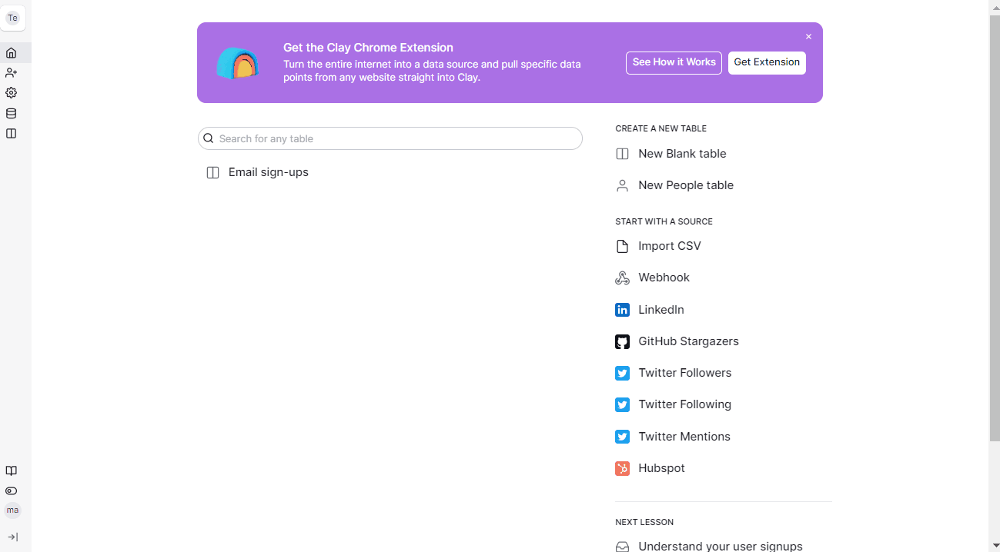

# Twitter Followers



### Step 1 - Creating a source 

Create a `Twitter Followers` source and authenticate your account then click `Continue`.​

<figure><figcaption></figcaption></figure>

### Step 2 - Adding a username to extract Twitter followers 

Input the `Twitter Username` that you want to extract and click `Continue`. Select if you want to add the data to your existing table or new table.\

<figure><figcaption></figcaption></figure>
